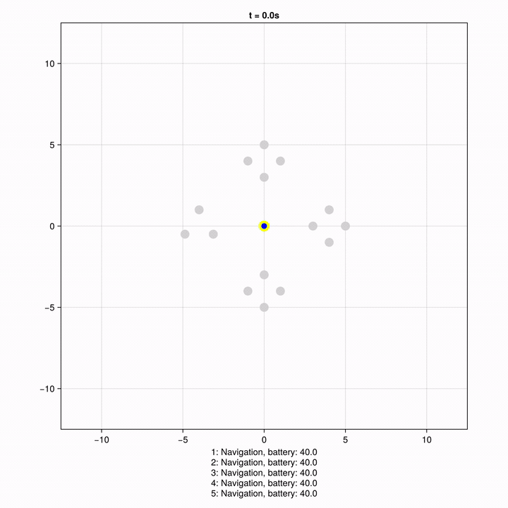

# Búsqueda en árbol de Monte Carlo descentralizada para la asignación de tareas multi-robot bajo incertidumbre

**Trabajo de Fin de Máster** · Máster Universitario en Lógica, Computación e Inteligencia Artificial
**Universidad de Sevilla** — Escuela Técnica Superior de Ingeniería Informática
Departamento de Ciencias de la Computación e Inteligencia Artificial

|  |  |
|---|---|
| **Autor** | Manuel Olías López |
| **Tutor** | Ignacio Pérez-Hurtado de Mendoza |
| **Memoria** | [`memoria.pdf`](memoria.pdf) — 101 páginas |

---

## Una ejecución, de principio a fin



Cinco robots resolviendo quince tareas bajo incertidumbre ([vídeo en calidad
completa](docs/demo.mp4)). Es una ejecución real del catálogo evaluado —escenario
`esc_C_r05_n015_E_est_q1_i4`, régimen estocástico— en la que Dec-MCTS completa **catorce de las
quince tareas sin perder ningún robot**. La visualización la genera `mrtau video`, del repositorio
del tutor, a partir del fichero de registro de la ejecución.

Cómo se lee:

- El punto **amarillo** del centro es la **estación de recarga**; los demás son las **tareas**,
  repartidas en racimos.
- Una tarea está **gris** mientras su ventana no se ha abierto, **verde claro** cuando se puede
  ejecutar, **roja** si su plazo venció sin que nadie llegase, **verde** cuando se completa y
  **negra** si el intento fracasó.
- Los puntos pequeños **azules** son los robots. Al pie se lee lo que hace cada uno y **cuánta
  batería le queda**; arriba, el instante de simulación.

Obsérvese lo que hace difícil el problema: las tareas no están disponibles desde el principio ni
para siempre, la batería se agota y obliga a volver al centro, y ningún robot ve el plan de los
demás —solo lo que le comunican.

## El problema

La **asignación de tareas multi-robot bajo incertidumbre** (MRTAU) consiste en decidir qué robot
hace qué tarea y en qué orden. Este trabajo aborda una versión enriquecida, con cuatro
particularidades que la acercan a un escenario real:

- **tiempo continuo**, con duraciones y desplazamientos que no encajan en turnos discretos;
- **coaliciones**: hay tareas que exigen varios robots a la vez;
- **ventanas de ejecución**: cada tarea tiene un instante a partir del cual puede empezarse y un
  plazo tras el cual ya no sirve de nada;
- **batería finita**, que hay que reponer en una estación, y que puede dejar a un robot tirado.

Y, sobre todo, **incertidumbre**: ni la duración de una tarea ni su éxito están garantizados. El
punto de partida es un planificador **centralizado**, con acceso al estado global. Lo que aquí se
construye es su contrario: un esquema **puramente distribuido**, en el que cada robot decide por su
cuenta con su información local y lo que sus vecinos le comunican.

## Los cinco algoritmos comparados

| Solver | Qué hace | Comunicación |
|---|---|---|
| `random` | Elige una tarea disponible al azar | ninguna |
| `greedy` | Elige la mejor tarea según una heurística local | ninguna |
| `cbaa` | Pujas por consenso, tarea a tarea (Choi et al.) | consenso sobre pujas |
| `cbba` | Pujas por consenso sobre paquetes de tareas (Choi et al.) | consenso sobre pujas |
| **`dec-mcts`** | **Búsqueda en árbol de Monte Carlo descentralizada: cada robot planifica con su propio árbol** | **distribución de probabilidad sobre sus planes** |

Los *baselines* y los métodos de pujas son métodos establecidos de la literatura; **la aportación
de este trabajo es `dec-mcts`**, construido a partir de la formulación del problema como
DEC-POGSMDP.

## Resultados

Evaluación sobre **360 escenarios × 5 algoritmos × 3 réplicas = 5 400 ejecuciones**. La métrica es
la **fracción de tareas completadas**.

| Solver | Global | Determinista | σ=1 | σ=3 | σ=5 |
|---|---|---|---|---|---|
| **dec-mcts** | **0.502** | **0.586** | **0.495** | **0.443** | **0.282** |
| cbba | 0.459 | 0.532 | 0.467 | 0.405 | 0.273 |
| cbaa | 0.401 | 0.483 | 0.413 | 0.339 | 0.207 |
| greedy | 0.346 | 0.396 | 0.338 | 0.313 | 0.198 |
| random | 0.268 | 0.305 | 0.266 | 0.242 | 0.168 |

Dec-MCTS obtiene la mejor recompensa media en los cuatro regímenes de incertidumbre y en cuatro de
los cinco bloques del catálogo. Frente a CBBA, el más cercano, la diferencia pareada es de
**+0.043 ± 0.004**, con 244 escenarios a favor, 33 empates y 83 en contra. El análisis completo
—dónde esa ventaja se estrecha y qué precio paga por ella— está en el capítulo 6 de la
[memoria](memoria.pdf) y en el cuaderno `analisis/evaluacion_final.ipynb`.

## Estructura del repositorio

| Ruta | Contenido |
|---|---|
| `src/` | Motor: ejecutor de experimentos, simulador de eventos, escenario, estado y registro |
| `include/tau/` | Cabeceras del motor y los cinco algoritmos (*header-only*) |
| `scenarios/catalogo/` | Los 360 escenarios del estudio (`esc_*.yaml`) y su configuración |
| `scenarios/*.yaml` | Dos escenarios sueltos, para una prueba rápida |
| `scripts/` | Generación del catálogo, lanzamiento de tandas y extracción de métricas |
| `logs/eval_catalogo/` | Los 5 400 registros de las ejecuciones evaluadas |
| `analisis/` | Cuaderno de evaluación, tabla de métricas y las 14 figuras del análisis |
| `docs/` | Vídeo de la ejecución de ejemplo |
| `memoria.pdf` | Memoria completa del trabajo |

## Cómo se ejecuta

Requisitos: **C++17**, CMake y **yaml-cpp**. Para el análisis, Python 3.12.

```bash
# Compilar (en Release: es tres veces más rápido y no altera los resultados)
cd build && cmake .. -DCMAKE_BUILD_TYPE=Release && make

# Una tanda, desde el directorio build/. Sin argumentos usa el catálogo completo
./simulador                                       # scenarios/catalogo → logs/salida
./simulador <dirEscenarios> <dirLogs> [config]

# El catálogo entero, repartido entre varios procesos (~35 min con 6)
cd .. && scripts/run_catalog.sh 6
```

`experiment_config.yaml` define qué solvers, qué funciones de recompensa y cuántas réplicas se
ejecutan. El ejecutor es **idempotente**: salta los registros ya completos, así que una tanda
interrumpida se reanuda sola.

Para regenerar los escenarios: `python3 scripts/generate_catalog.py`.

### Análisis

```bash
# Registros → tabla de métricas (solo biblioteca estándar)
python3 scripts/extract_metrics.py logs/eval_catalogo -o analisis/catalogo.csv

# Todas las tablas en consola
python3 scripts/analyze_catalog.py analisis/catalogo.csv

# El análisis completo, con sus figuras
python3 -m venv .venv && .venv/bin/pip install -r analisis/requirements.txt
.venv/bin/jupyter lab analisis/evaluacion_final.ipynb
```

> **Sobre la reproducibilidad**: el simulador no tiene semilla configurable, de modo que repetir
> una tanda no devuelve exactamente los mismos números (de ahí las tres réplicas por escenario).
> Por eso se publican **los 5 400 registros en crudo**: son la evidencia de las cifras de la
> memoria y permiten rehacer todo el análisis sin volver a simular.

## Licencia

El software de este repositorio se distribuye bajo la **licencia MIT**: ver el fichero
[`LICENSE`](LICENSE). Cubre el código, los generadores de escenarios y las herramientas de
análisis.

**El texto de la memoria** (`memoria.pdf`) no forma parte de ese permiso: © 2026 Manuel Olías
López, todos los derechos reservados.

La herramienta `mrtau`, usada para generar la visualización, pertenece al repositorio del tutor:
[multirobot-use/mrtau](https://github.com/multirobot-use/mrtau).
